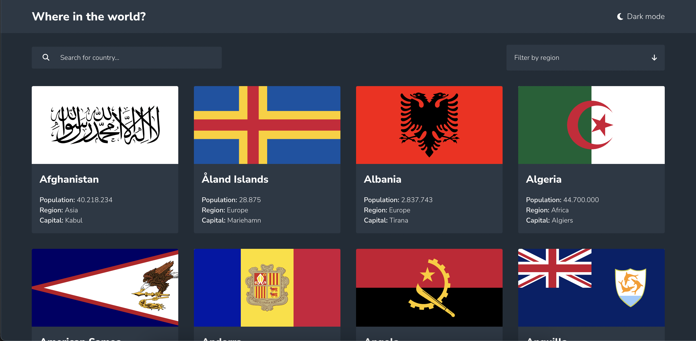
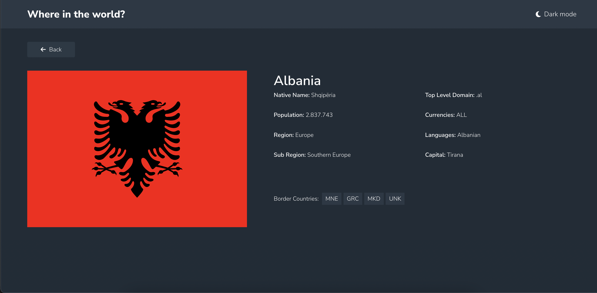
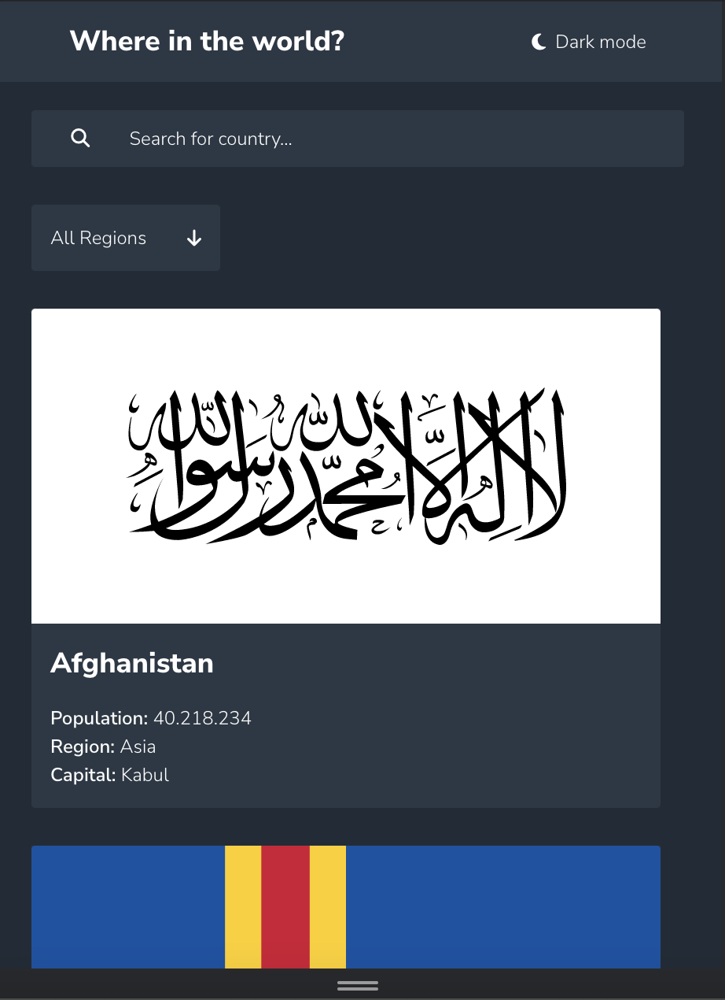

# Frontend Mentor - REST Countries API with color theme switcher solution

<style>
  * {
    scroll-behavior:smooth;
    scroll-snap-align:center
  }
</style>
This is a solution to the [REST Countries API with color theme switcher challenge on Frontend Mentor](https://www.frontendmentor.io/challenges/rest-countries-api-with-color-theme-switcher-5cacc469fec04111f7b848ca). Frontend Mentor challenges help you improve your coding skills by building realistic projects. 

## Table of contents

- [Overview](#overview)
  - [The challenge](#challenge)
  - [Screenshot](#screenshot)
  - [Links](#links)
  - [Built with](#tools)
  - [What I learned](#learned)
- [Author](#author)


<article id="overview">
  <h1>Overview</h1>
    <p>
    Simple Countries App with React.
    </p>
  </article>

<article id="challenge">
  <h1>The challenge</h1>

  Users should be able to:

- See all countries from the API on the homepage 
  - On my project, I used raw json data instead of build rest api with that data.You can build if you want to. 
- Search for a country using an `input` field
- Filter countries by region
- Click on a country to see more detailed information on a separate page
- Click through to the border countries on the detail page
- Toggle the color scheme between light and dark mode *(optional)*
</article>

<article id="screenshot">
  <h1>Screenshot</h1>
  
  <br/>
  
  <br/>
  
</article>


<article id="links">
  <h1>Links</h1>
  <p>
    <a>Solution URL</a> <br/>
    <a href="https://countries-app-gamma-two.vercel.app/">Site URL</a>
  </p>
 
<article>


<article id="tools">
  <h1>Tools</h1> 

- Semantic HTML5 markup
- [Sass](https://sass-lang.com/)
- Flexbox
- CSS Grid
- Mobile-first workflow
- [React](https://reactjs.org/) - JS library

</article id="learned">

<h1>What I learned</h1>

I can filter data according to user input

```js
    useEffect(() => {
    if (selectedRegion !== "Filter by region") {
      if (selectedRegion === "All Regions") {
        setSearch("");
        setCountries(data)
      }
      else if (search) {
        let selectedRegionArray = data.filter(el => el?.region === selectedRegion && el.name.toLowerCase() === search.toLowerCase())
        setCountries(selectedRegionArray);
      }
      else {
        let selectedRegionArray = data.filter(el => el?.region == selectedRegion);
        setCountries(selectedRegionArray);
      }

    }
  }, [selectedRegion, setSelectedRegion])
```


<article>
  <h1>Author</h1>

- Frontend Mentor - [@GorkemEldeniz](https://www.frontendmentor.io/profile/GorkemEldeniz)

</article>


